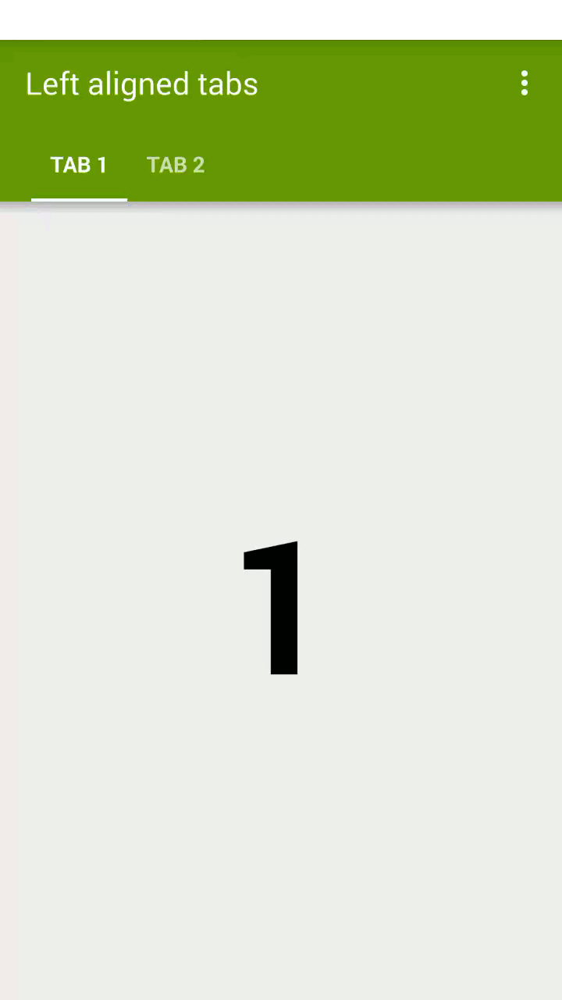
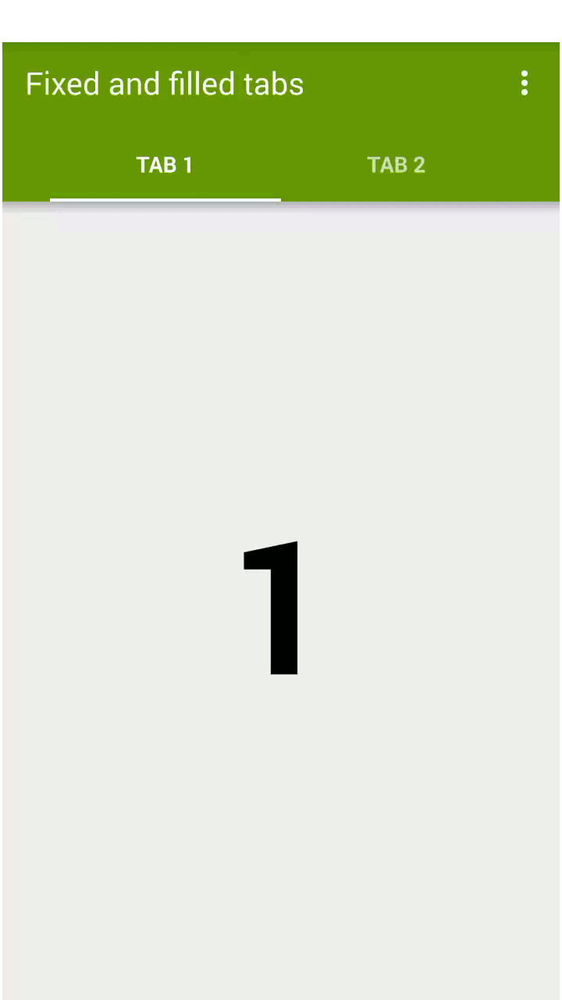

# SlidingTabs

Tabs created with the new android.support.design.widget.TabLayout

**Support goes all the way back to API 10**

## Tab Modes

- Left aligned
- Centered
- Filled (fills all width)
- Scrollable
- Animated (can be used with all of above)

## Screenshots
 
 

## Dependencies

    compile 'com.android.support:appcompat-v7:22.2.0'
    compile 'com.android.support:design:22.2.0'
    
## License
    Copyright © 2015 Rúben Sousa <rubensousa.mieti@gmail.com>
    This work is free. You can redistribute it and/or modify it under the
    terms of the Do What The Fuck You Want To Public License, Version 2,
    as published by Sam Hocevar. See the LICENSE file for more details.

