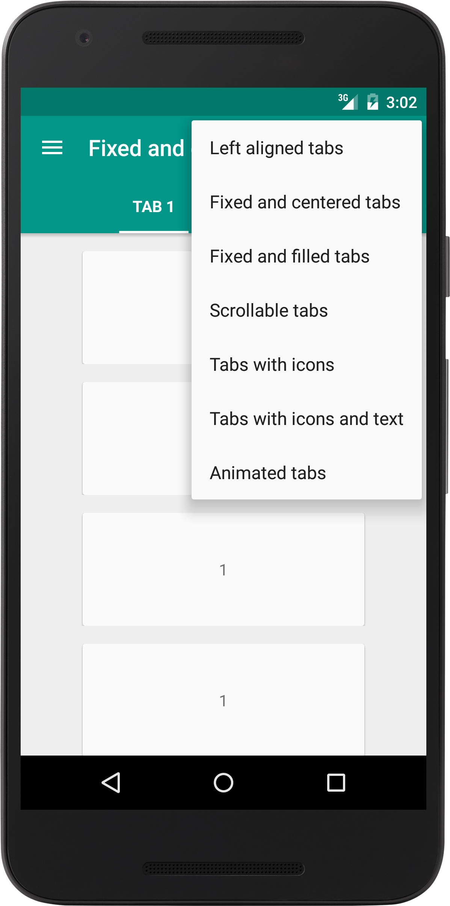
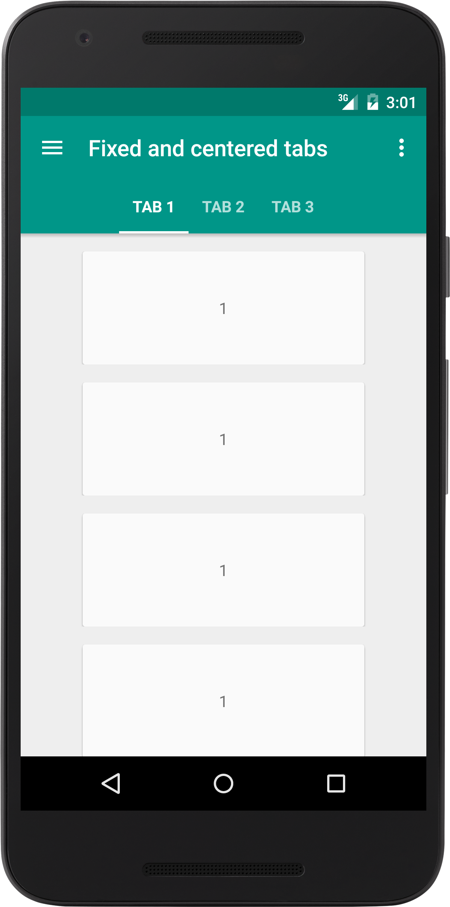
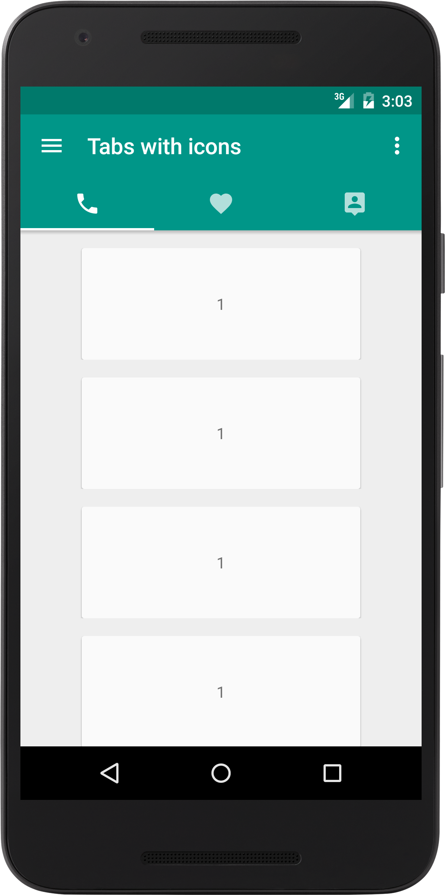
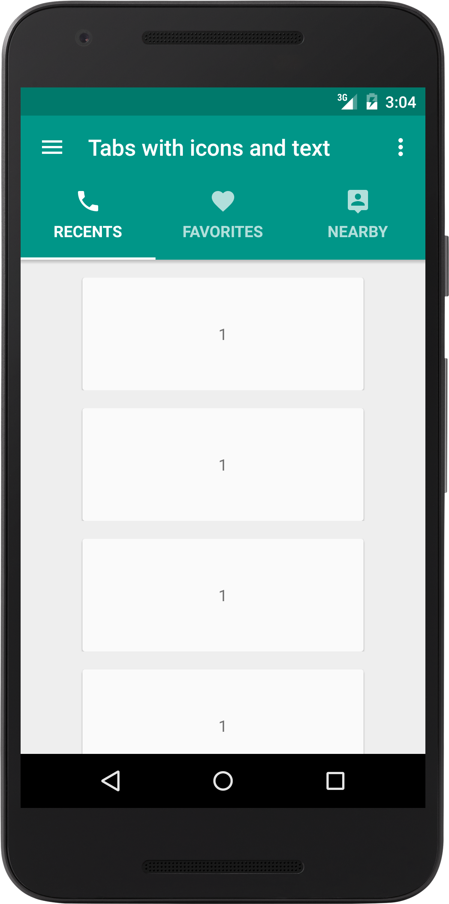

# SlidingTabs

Tabs created with the new android.support.design.widget.TabLayout

Includes a fake shadow below the AppBar for devices with API < 21 and toolbar scrolling behavior.

## This sample is no longer being maintainable. Please, check this helper library instead: https://github.com/rubensousa/TabLayoutAdapter

## Tab Modes

- Left aligned
- Centered
- Filled (fills all width)
- Scrollable
- Icons
- Icons and text
- Animated (can be used with all of above)

## Screenshots
 
 

## Dependencies

    compile 'com.android.support:appcompat-v7:23.3.0'
    compile 'com.android.support:design:23.3.0'
    compile 'com.android.support:cardview-v7:23.3.0'
    compile 'com.android.support:recyclerview-v7:23.3.0'
    
##License:
    Copyright © 2015 Rúben Sousa <rubensousa.mieti@gmail.com>
    This work is free. You can redistribute it and/or modify it under the terms
    of the Do What The Fuck You Want To Public License, Version 2, as published by Sam Hocevar.
    See the LICENSE file for more details.

